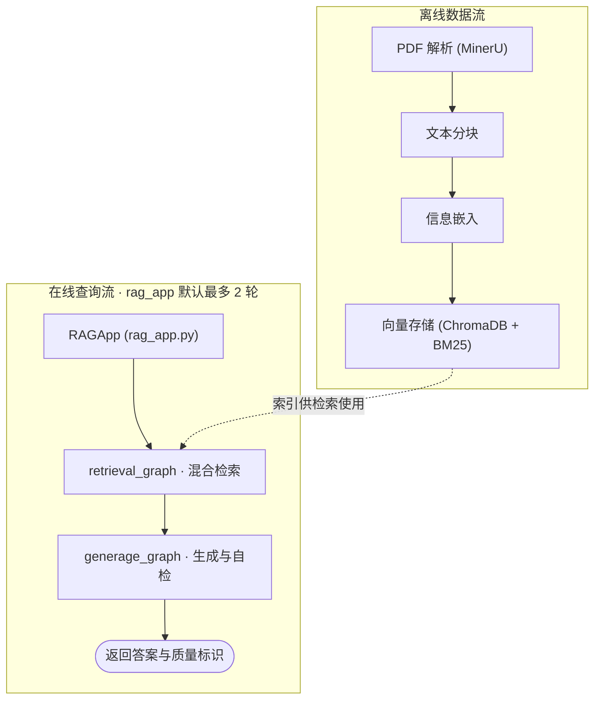
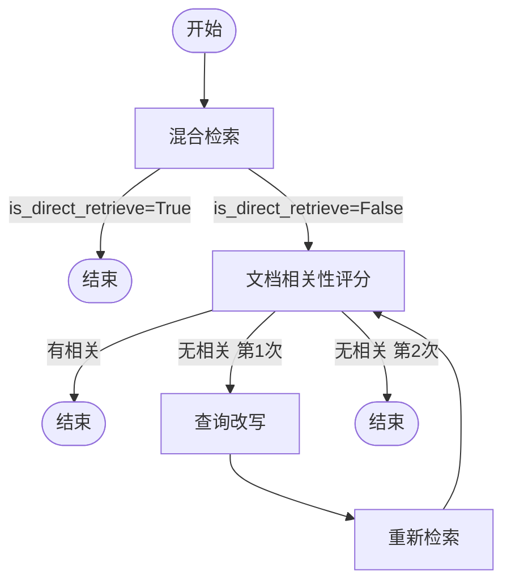
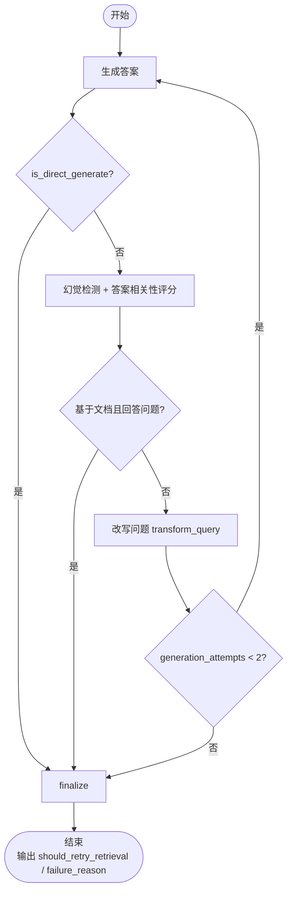
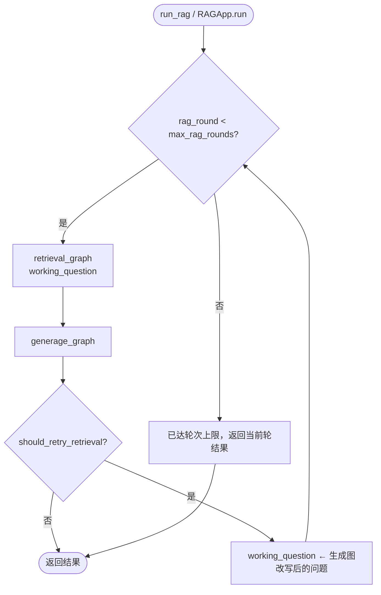

# PowerProjDoc-RAG

面向**电网基建项目长文档**（建设报告、财务报告等）的**检索增强生成（RAG）系统**。系统支持从 PDF 解析、文本分块、向量化存储到智能检索与答案生成的完整流水线，并基于 LangGraph 实现 Self-RAG 风格的**自适应检索**与**自适应生成**工作流，集成混合检索、LLM 重排、父文档回溯、幻觉检测与答案相关性自检等策略。`rag_app` 作为编排层，在生成仍不合格时可依据 `should_retry_retrieval` 触发外层重新检索（默认最多 2 轮），以提升复杂文档问答的准确性与可解释性。

---

## 系统架构

<div align="center">



</div>

**查询链路**：用户问题 → `rag_app` 调用 `retrieval_graph` 混合检索并过滤相关文档 → `generage_graph` 基于文档生成答案并自检（同文档内最多 2 次生成）→ 若仍不合格且未达 `max_rag_rounds`，用改写后的问题重新检索并生成 → 返回答案与质量标识。

---

## 核心功能模块

### 1. 数据导入（Ingestion）

- **PDF 解析**：调用 [MinerU](https://mineru.net/) API 将 PDF 转换为结构化 Markdown / JSON，保留原始排版与表格信息。
- **报告合并**：将 MinerU 解析结果规整为标准报告结构（`metainfo` + `content.pages`），写入 `company_code` 等元数据。

> 相关代码：`src/pdf_mineru.py`、`src/markdown_reports_merging.py`  
> 规格文档：`spec/ingestion_spec.md`、`spec/reports_merging_spec.md`

### 2. 文本分块（Chunking）

- 支持 **Markdown 行级分块** 与 **通用 JSON 报告分块** 两种模式。
- 使用 `RecursiveCharacterTextSplitter`（基于 `tiktoken`）控制 chunk_size 与 chunk_overlap。
- 可选插入**序列化表格块**，保证表格信息不丢失。
- 自动关联 `company_code`、`sha1`、`file_name` 等元数据。

> 相关代码：`src/text_splitter.py`

### 3. 信息嵌入与向量存储（Embedding & Vector Store）

- 基于 **OpenAI Embedding API**（默认 `text-embedding-3-large`）生成文本向量。
- 使用 **ChromaDB** 作为向量数据库，持久化存储，支持按 `company_code` 等元数据过滤检索。
- 同时构建 **BM25 索引**（基于 `rank_bm25`），实现稀疏检索能力。

> 相关代码：`src/openai_embedding.py`、`src/ingestion.py`  
> 配置：`src/config.py`（`settings.chroma_persist_dir`、`settings.bm25_output_dir`）

### 4. 检索前处理（Pre-Retrieval）

- **元数据过滤**：利用 LLM 从用户查询中抽取省公司编码（`unit_code`）等过滤条件，生成 ChromaDB `where` 子句；若调用方已传入编码则直接复用。
- **多角度查询扩展**：基于原始查询生成 3 个检索友好变体（语义扩展 / 关键词聚焦 / 结构化条件），提升召回率。

> 相关代码：`src/pre_retrieval_processing.py`  
> 规格文档：`spec/pre_retrieval_spec.md`

### 5. 索引优化（Parent Document Retrieval）

- **父文档检索**：检索时使用子文本块进行相似度匹配，但返回该子块所属的**整页内容**作为上下文，避免信息碎片化，提升答案完整性。

> 相关代码：`src/retrieval.py`（`return_parent_pages` 参数）

### 6. 检索与检索后处理（Retrieval & Post-Retrieval）

- **混合检索（Hybrid Retrieval）**：
  - `VectorRetriever`：基于 ChromaDB 的语义相似度检索，支持 `company_code` 过滤。
  - `BM25Retriever`：基于关键词的稀疏检索。
  - `HybridRetriever`：向量召回 Top-28 + **LLM 重排**取 Top-6，LLM 分数与向量相似度按 **0.7:0.3** 加权融合。
- **重排策略**：
  - **Jina Reranker**：调用 Jina API 进行多语言重排。
  - **LLM Reranker**：使用 GPT-4o-mini / Qwen-Turbo 对检索结果进行相关性评分。
- **检索后校正**：通过 LLM 对检索文档与问题进行二元相关性评分（`yes/no`），过滤低质量上下文。

> 相关代码：`src/retrieval.py`、`src/reranking.py`、`src/post_retrieval_correction.py`  
> 规格文档：`spec/retrieval_spec.md`、`spec/post_retrieval_spec.md`

### 7. 自适应检索工作流（Retrieval Graph）

基于 **LangGraph** 实现的状态机，负责混合检索与相关性过滤，**不生成自然语言答案**：



- 最多 **2 次**混合检索（首次 + 改写后 1 次）；第 1 次无相关文档时改写问题再检索，第 2 次仍无相关则返回当前结果。
- `is_direct_retrieve=True` 时跳过评估，检索一次后直接返回，便于对比测试。

> 相关代码：`src/retrieval_graph.py`  
> 规格文档：`spec/retrieval_graph_spec.md`

### 8. 自适应生成工作流（Generation Graph）

基于 **LangGraph** 实现的 Self-RAG 生成侧，给定检索文档生成答案并自检，**不执行检索**：



- **幻觉检测**：先判断生成是否严格基于检索文档；仅当基于文档时再判断答案相关性。
- **同文档内重试**：评分失败时改写问题后在**同一批文档**上再生成一次，最多 **2 次**生成（首次 + 改写后 1 次）；不做同输入盲重试。
- **重检索信号**：同文档内仍失败时，`finalize` 写出 `should_retry_retrieval=True` 与 `failure_reason`（`hallucination` / `not_answered`），由 `rag_app` 编排外层重新检索；本图**不执行检索**。
- **生成温度**：`RAGGenerator` / 改写器 / 评分器均使用 `temperature=0`（默认 `settings.chat_model` 或 `gpt-4o`）。
- `is_direct_generate=True` 时跳过评估，生成一次后直接返回（`failure_reason=skipped`）。

> 相关代码：`src/generage_graph.py`  
> 规格文档：`spec/generage_graph_spec.md`

### 9. RAG 应用入口（RAG App）

最终编排层，串联检索图与生成图，并负责**外层「检索 + 生成」循环**：



```python
from src.rag_app import run_rag

result = run_rag(
    question="工程总投资是多少？",
    company_code="001",
    max_rag_rounds=2,  # 外层最大轮数，默认 2
)
print(result["generation"])
```

**返回字段**：

| 字段 | 说明 |
|------|------|
| `question` | 用户原始问题（全程不变） |
| `working_question` | 最后一轮实际用于检索/生成的问题（可能被生成图改写） |
| `documents` | 检索到的文档列表 |
| `generation` | 最终生成的答案 |
| `has_relevant_docs` | 检索文档是否相关（直接检索模式下未评估） |
| `is_direct_retrieve` | 是否使用了直接检索模式 |
| `is_grounded_in_docs` | 生成是否基于检索文档（直接生成模式下未评估） |
| `is_question_answered` | 生成是否回答了用户问题（直接生成模式下未评估） |
| `is_direct_generate` | 是否使用了直接生成模式 |
| `should_retry_retrieval` | 最后一轮生成图是否仍建议重检索 |
| `failure_reason` | 最后一轮失败原因：`ok` / `hallucination` / `not_answered` / `skipped` |
| `rag_rounds` | 实际执行的外层轮数 |

> 相关代码：`src/rag_app.py`  
> 规格文档：`spec/rag_app_spec.md`

### 10. 数据流水线（Pipeline）

`Pipeline` 负责离线数据处理：PDF 解析 → 报告规整 → 分块 → 构建向量库 / BM25 索引，并提供独立的检索方法供调试。

> 相关代码：`src/pipeline.py`  
> 规格文档：`spec/pipeline_spec.md`

### 11. 系统评估（Evaluation）

基于 **ragas** 框架的离线批量评估与单条实时评估，覆盖检索召回率、忠实度、答案相关性等指标，并自定义页面级 `page_recall@k`。

> 相关代码：`eval/evaluation.py`  
> 规格文档：`spec/evaluation_spec.md`

---

## 快速开始

### 环境配置

1. 复制环境变量模板并填写 API Key：

```bash
cp .env_example .env
```

2. 编辑 `.env`（所有配置统一通过 `src/config.py` 的 `settings` 读取）：

```env
OPENAI_API_KEY=sk-...
OPENAI_API_BASE=https://api.openai.com/v1   # 如需自定义 base url
CHAT_MODEL=gpt-4o                           # 生成/评分/改写，留空时 generage_graph 默认 gpt-4o
EMBEDDING_MODEL=text-embedding-3-large      # 留空时使用 ingestion 默认值

# 可选
JINA_API_KEY=...
MINERU_API_KEY=...
DASHSCOPE_API_KEY=...
GEMINI_API_KEY=...

# 数据目录（留空使用 config.py 默认值）
CHROMA_PERSIST_DIR=data/projdoc_data/databases/vector_dbs
BM25_OUTPUT_DIR=data/projdoc_data/databases/bm25_index   # ingestion 默认；Pipeline 写入 databases/bm25_dbs
REPORTS_INPUT_DIR=data/projdoc_data/databases/chunked_reports
```

3. 安装依赖（请根据项目实际环境安装）。

### 运行 RAG 查询（推荐入口）

索引构建完成后，通过 `rag_app` 执行端到端问答：

```python
from src.rag_app import run_rag

result = run_rag(
    question="工程总投资是多少？",
    company_code="001",
)

print(result["generation"])
print(f"文档相关: {result['has_relevant_docs']}")
print(f"基于文档: {result['is_grounded_in_docs']}")
print(f"回答问题: {result['is_question_answered']}")
print(f"失败原因: {result['failure_reason']}")
print(f"外层轮数: {result['rag_rounds']}")
```

**对比测试模式**（跳过检索/生成质量评估，加快调试）：

```python
result = run_rag(
    question="工程总投资是多少？",
    company_code="001",
    is_direct_retrieve=True,
    is_direct_generate=True,
)
```

### 运行数据流水线

```python
from pyprojroot import here
from src.pipeline import Pipeline, PipelineConfig

# 初始化流水线
pipeline = Pipeline(PipelineConfig.from_root(here() / "data" / "projdoc_data"))

# 步骤1：PDF -> Markdown（按需执行）
# pipeline.export_reports_to_markdown("report.pdf")

# 步骤2：MinerU JSON -> 标准报告结构
# pipeline.merge_mineru_reports(reports_dir=here() / "data" / "projdoc_data" / "debug_data")

# 步骤3：文本分块
pipeline.chunk_reports()        # Markdown 分块
# pipeline.chunk_reports2()     # 通用 JSON 报告分块

# 步骤4：构建向量库
pipeline.create_vector_dbs()

# 步骤5：构建 BM25 索引
pipeline.create_bm25_db()

# 步骤6：独立检索调试
results = pipeline.hybrid_retrieve(
    query="工程总投资是多少？",
    company_code="001",
    return_parent_pages=True,
)
for r in results:
    print(f"Page {r['page']}: {r['text'][:100]}...")
```

---

## 项目结构

```
.
├── data/                           # 数据目录
│   └── projdoc_data/
│       ├── debug_data/             # 调试中间产物（解析结果、合并报告、Markdown）
│       └── databases/              # 向量库、分块报告、BM25 索引
├── spec/                           # 规格文档（与 src/ 代码同步维护）
│   ├── amendments/                 # 局部 spec 修订（pending → merged）
│   ├── rag_app_spec.md
│   ├── retrieval_graph_spec.md
│   ├── generage_graph_spec.md
│   ├── pipeline_spec.md
│   └── ...
├── src/                            # 核心源码
│   ├── config.py                   # 全局配置（.env → settings）
│   ├── pdf_mineru.py               # PDF 解析（MinerU API）
│   ├── markdown_reports_merging.py # MinerU JSON 规整
│   ├── text_splitter.py            # 文本分块
│   ├── openai_embedding.py         # OpenAI 嵌入封装
│   ├── ingestion.py                # ChromaDB / BM25 索引构建
│   ├── pre_retrieval_processing.py # 检索前处理（过滤、多角度查询）
│   ├── retrieval.py                # 检索器（向量 / BM25 / 混合）
│   ├── reranking.py                # 重排器（Jina / LLM）
│   ├── post_retrieval_correction.py# 检索后校正
│   ├── retrieval_graph.py          # LangGraph 自适应检索工作流
│   ├── generage_graph.py           # LangGraph 自适应生成工作流
│   ├── rag_app.py                  # 最终 RAG 应用入口
│   ├── pipeline.py                 # 离线数据处理流水线
│   └── questions_processing.py     # 问题处理与答案生成（遗留模块）
├── eval/                           # 评估模块
│   └── evaluation.py
├── tests/                          # 测试用例（含 test_rag_app.py 等）
├── examples/                       # 使用示例
└── README.md
```

---

## 技术亮点

### 生成器（Generator）

- 基于 LangGraph 实现 **Self-RAG 生成侧**：生成 → 幻觉检测 → 答案相关性评分 → 改写问题 → 同文档再生成；同文档内最多 **2 次**生成。
- 仍不合格时输出 `should_retry_retrieval`，由 `rag_app` 触发外层重新检索（默认最多 **2 轮**）。
- 支持 `is_direct_generate` 开关，便于 A/B 对比与调试。
- 生成严格依据检索文档（`temperature=0`），禁止引入外部知识。

### 检索器（Retriever）

- 构建**多路混合检索架构**：Dense Retrieval（ChromaDB + OpenAI Embedding）与 Sparse Retrieval（BM25）相结合；支持按 `company_code` 元数据过滤。
- 引入**检索前查询优化**：LLM 自动生成 3 个角度的检索变体，并结合元数据过滤构建 ChromaDB `where` 子句。
- 实现**检索后精排与校正**：向量召回 Top-28，LLM 重排后取 Top-6；`retrieval_graph` 内层实现「检索 → 相关性评分 → 查询改写 → 再检索」，最多 2 次检索。
- 支持**父文档检索**：以子块召回、返回整页父文档作为上下文。
- **`rag_app` 外层重检索**：生成图返回 `should_retry_retrieval=True` 时，用改写后问题重新走检索+生成（默认最多 2 轮）。

### 系统评估（Evaluator）

- 基于 ragas 构建自动化评测体系：检索侧关注页面召回率与上下文精确度；生成侧关注忠实度与答案相关性。
- 提供 `RAGEvaluator`（批量离线）与 `SingleTurnEvaluator`（单条实时）两种评估入口。

---

## License

MIT
